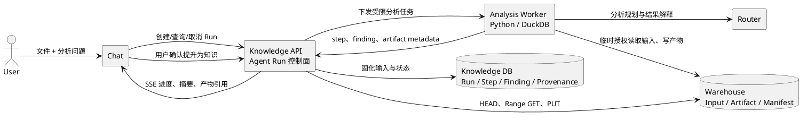
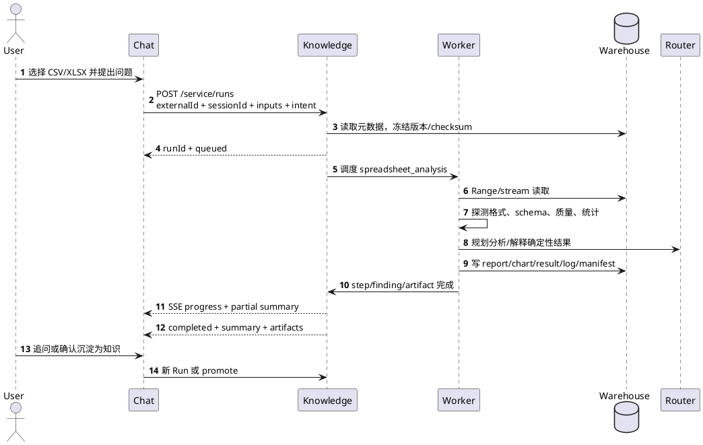

# 知识库架构 V2

> 状态：目标架构，尚未完整实现
>
> 文档日期：2026-08-08
>
> 前置基线：[知识库架构 V1](知识库架构V1.md)

## 1. V2 研发重点

> 当前实现补充：V2 仍以“文件资产 -> 可审计分析任务 -> 对话结果 -> 可复用知识”为主线；同时已启动一条支撑主线的知识源接入能力建设，把文档解析、chunk、外部来源发现和 Evidence 构建拆成可替换端口，并通过源码搬入后的本地适配实现第一批 connector/parser/chunker。该能力不改变 Knowledge 领域模型，所有外部来源必须落到 `Source`、`SourceAsset`、`EvidenceUnit` 和后续 Knowledge Item 链路。

V2 的第一研发重点不是继续扩展传统文档检索，而是打通“文件资产 -> 可审计分析任务 -> 对话结果 -> 可复用知识”的完整链路：

1. **深度集成 Warehouse**：Warehouse 作为 CSV、Excel、报告、图表和运行日志的唯一文件数据面；Knowledge 保存资产引用、任务状态、分析过程、产物元数据和 provenance。
2. **向 Chat 提供 Agent 能力**：用户在 Chat 中选择或上传 CSV、Excel 文件并提出问题，由 Knowledge 创建和编排 `spreadsheet_analysis` Agent Run，持续返回进度、摘要和产物。
3. **形成知识闭环**：分析结果默认是运行产物，不自动成为正式知识；用户确认后才能将结论连同文件、sheet、range、checksum 等证据提升为 Candidate、Evidence 和 Knowledge Item。

本文只记录尚未完成或尚未完整完成的目标。当前可用能力以代码、[OpenAPI](openapi/knowledge.openapi.yaml)和 V1 文档为准。

### 1.1 当前正在开发的功能

当前开发聚焦两条相互支撑的能力：

1. **可审计表格分析 Agent**：围绕 Warehouse 文件、`AgentRun`、Worker、Artifact 和 manifest，完成 CSV/Excel 从 Chat 发起、后台分析、进度回报、产物登记和后续知识提升的闭环。
2. **模块化知识源接入**：把外部来源发现、文件读取、解析、chunk 和 Evidence 构建拆到 ports/adapters，先支持 Warehouse 默认路径，再扩展 `local_file` 和 `github_repository` 这类 source connector，后续继续接更多连接器和更强文档解析能力。

当前不是在开发“接入某个外部服务平台”的集成模式，而是在把有价值的源码能力搬入当前项目，改造成 Knowledge 自己的模块。运行时代码、配置和 `source_type` 使用 Knowledge 自有命名，不暴露外部项目品牌。

### 1.2 已落地的架构变化

- 新增稳定端口：`DocumentParserPort`、`DocumentChunkerPort`、`SourceConnectorPort`，领域服务只依赖端口，不直接依赖第三方内部模型。
- 新增本地适配层：`knowledge/adapters/ragflow` 负责 parser/chunker 适配；`knowledge/adapters/connectors` 负责 source connector 适配。
- 新增源码快照目录：`knowledge/third_party/ragflow` 和 `knowledge/third_party/connectors`，仅作为本地源码参考和逐步裁剪对象，来源、commit 和 license 记录在 `knowledge/third_party/SOURCES.md`。
- 新增 source connector 模式：`warehouse`、`local_file`、`github_repository`。`local_file` 和 `github_repository` 已能通过 source scan 发现资产，写入 `SourceAsset`，并进入 Evidence 构建链路。
- 新增 parser/chunker 模式：默认仍为 `local`；可显式启用 `ragflow` parser/chunker，失败时回退到本地实现，避免影响默认链路。
- Evidence 构建已从“只读 Warehouse 文件”扩展为“按 `source_type` 选择读取器”，读取后仍统一进入 parser、chunker、EvidenceUnit、vector index。

## 2. 系统边界

| 系统 | V2 职责 | 不承担的职责 |
| --- | --- | --- |
| Chat | 用户对话、附件选择、分析意图采集、进度与结果展示、追问 | 不保存 Warehouse 长期凭证，不执行表格计算，不维护 Run 主状态 |
| Knowledge | Agent Run 控制面、输入冻结、分析计划、Worker 编排、审计、产物登记、知识提升 | 不在数据库保存原始表格或结果文件，不自行实现对象存储权限 |
| Warehouse | 原始文件和派生文件的数据面、对象元数据、校验、流式读写、配额和资产变更 | 不解析 CSV/Excel，不拥有 Agent Run、分析结论或知识语义 |
| Router | 模型访问、路由、额度和计量 | 不执行数据计算，不保存文件和 Run 状态 |
| 分析 Worker | 在隔离环境内读取数据、执行确定性计算、生成产物 | 不直接面向 Chat，不持有跨租户长期凭证 |

核心原则：**LLM 负责规划、解释和生成受控操作，计算引擎负责读取、聚合和校验数据。** 不允许模型凭上下文中的少量样本自行推断完整数据集的统计结果。

## 3. 总体架构



Knowledge 数据库只保存控制面信息和可检索的结构化摘要。CSV/XLSX 原文、清洗后的数据、图表和报告继续保存在 Warehouse。

## 4. Warehouse 集成基线与要求

### 4.1 当前可复用能力

根据 Warehouse 当前代码，Knowledge 可以基于以下公开能力开始第一阶段集成：

| 能力 | 当前状态 | Knowledge 用法 |
| --- | --- | --- |
| 对象元数据 | 已公开 | 获取 `path`、`size`、`etag`、`checksumSha256`、`contentType`、`modifiedAt` |
| 对象内容 `HEAD/GET/PUT` | 已公开 | 输入探测、流式读取、写入分析产物 |
| Range 读取 | 可由内容下载接口支持 | 大文件分段探测、避免完整载入内存 |
| ETag 与 SHA-256 | 已具备 | 在 Run 启动时冻结输入身份，校验读写完整性 |
| 上传会话/分片机制 | 已具备基础能力 | 写入大型 XLSX、清洗后数据集和报告包 |
| 路径与读写权限范围 | 已有凭证字段和 scope 校验基础 | 为 Knowledge/Worker 限制可访问目录和操作 |
| 复制 outbox | 已有内部实现 | 只能视为 Warehouse 内部基础，尚不能作为外部变更订阅接口 |

当前元数据查询仍可能为了计算 SHA-256 打开并扫描文件，因此“有元数据接口”不等于“大对象低成本 HEAD”已经完整满足。V2 联调前需要用大文件压测确认。

### 4.2 Knowledge 对 Warehouse 的 P0 要求

| 编号 | 要求 | 验收标准 |
| --- | --- | --- |
| WH-P0-01 | 稳定资产引用 | 返回 `path`、不可变 `versionId`（或等价版本标识）、`etag`、`sha256`、`size`、`contentType`、`modifiedAt` |
| WH-P0-02 | 低成本元数据读取 | `HEAD`/metadata 不下载或扫描完整对象；百万行文件也能稳定快速返回 |
| WH-P0-03 | 条件与分段读取 | 支持 `Range`、`If-Match`；对象已变化时返回明确的 `412`，不能静默读取新内容 |
| WH-P0-04 | 原子产物提交 | 大文件使用分片/可恢复上传，完成前不可见为 final；完成时校验 SHA-256 |
| WH-P0-05 | 幂等写入 | 写入或 finalize 支持 `Idempotency-Key`，网络重试不产生重复对象或错误覆盖 |
| WH-P0-06 | 最小权限凭证 | 支持按 owner/app/path 限定 read/write，凭证可过期、轮换、撤销，且不涉及钱包私钥 |
| WH-P0-07 | 统一错误契约 | 至少区分不存在、版本冲突、校验失败、权限不足、配额不足、限流和暂时不可用 |
| WH-P0-08 | 可观测性 | 响应返回 request/correlation ID，Knowledge 能把 Warehouse 请求关联到 Run/Step |

`versionId` 是关键缺口。仅保存路径无法防止运行期间文件被覆盖；仅保存 ETag 也需要 Warehouse 明确其生成和跨节点一致性语义。在版本接口落地前，Knowledge 使用 `path + etag + sha256` 作为过渡冻结键，并在每次读取前复核。

### 4.3 Knowledge 对 Warehouse 的 P1 要求

1. **外部可订阅的资产变更流**：与内部 replication outbox 分离，提供单调 cursor、事件 ID、操作类型、源/目标路径、版本、checksum、发生时间、租户和 replay/retention 语义。
2. **服务端 copy/move**：支持不经 Knowledge 下载再上传地复制输入快照或提升产物。
3. **临时委托访问**：Knowledge 为某个 Run/Worker 签发短时、单路径、限定操作的访问能力；Chat 永远不接触长期凭证。
4. **配额预检**：在执行大任务前查询剩余空间和单对象/分片限制。
5. **契约版本化**：Warehouse OpenAPI、事件 schema 和错误码必须版本化并提供兼容策略。

资产变更流用于知识库持续同步，不作为首个 CSV/Excel 分析闭环的前置阻塞项。

## 5. Chat 面向用户的分析流程



用户体验要求：

- 创建成功后 1 秒内得到 `runId` 和排队状态，长任务不占用 Chat 单个 HTTP 请求。
- Chat 显示“读取文件、识别结构、分析、生成结果”等业务阶段，不暴露 Worker 内部日志。
- 用户可以取消、失败后重试、从产物下载结果，并基于同一个 Run 继续追问。
- 追问创建新的 Run 或显式 child run，引用上一 Run 的产物；已完成 Run 不被原地改写。
- 文件发生变化时明确提示“输入版本已变化”，由用户选择使用冻结版本或新建分析，不能静默替换。

## 6. Chat -> Knowledge 服务契约

V2 复用现有 `/service/runs` 和 `X-Service-Api-Key`，以向后兼容方式扩展；OpenAPI 落地时再决定是否发布 `/api/v2` 别名，不在实现前制造第二套 Run 资源。

建议接口：

```text
POST /service/runs
GET  /service/runs/{run_id}
GET  /service/runs/{run_id}/events       # SSE，轮询 GET run 作为降级
GET  /service/runs/{run_id}/artifacts
POST /service/runs/{run_id}/cancel
POST /service/runs/{run_id}/retry
POST /service/runs/{run_id}/promote
```

创建示例：

```json
{
  "external_id": "chat-message-42",
  "session_id": "chat-session-1",
  "run_type": "spreadsheet_analysis",
  "inputs": [
    {
      "kind": "warehouse_asset",
      "warehouse_path": "/apps/chat.yeying.pub/attachments/sales.xlsx",
      "version_id": "optional-before-warehouse-supports-it",
      "etag": "9b2cf...",
      "sha256": "b35a..."
    }
  ],
  "intent": "按地区比较销售额、利润率和异常订单，并输出结果表",
  "constraints": {
    "max_rows": 1000000,
    "allow_sampling": true,
    "output_formats": ["markdown", "xlsx"]
  }
}
```

契约规则：

- `external_id` 在 Service Principal 下幂等，Chat 重试返回同一个 Run。
- Chat 只能提交当前会话可见的附件引用；Knowledge 必须再次鉴权和冻结元数据。
- 调用方不能提交 owner wallet、任意 artifact 目标路径、Warehouse 凭证或 Worker 命令。
- 事件至少包含递增序号、阶段、进度、可展示消息、时间和是否可重试；断线后支持 `Last-Event-ID` 续传。
- `completed`、`failed`、`cancelled` 为终态；重试创建 attempt 或 child run，不篡改原执行证据。

## 7. CSV 与 Excel 分析引擎

### 7.1 标准执行阶段

1. **resolve**：解析 Warehouse 引用，校验权限并冻结版本、ETag、SHA-256 和大小。
2. **inspect**：识别 MIME、扩展名、CSV 编码/分隔符，或 XLSX sheet、范围和 workbook 特征。
3. **profile**：推断列类型、空值、唯一性、分布、异常值、敏感字段和数据质量问题。
4. **plan**：模型根据用户意图和 profile 生成结构化分析计划；计划必须经过策略校验。
5. **execute**：使用确定性引擎执行过滤、聚合、关联和统计，记录 SQL/Python、参数、输入范围和资源消耗。
6. **verify**：校验行数、关键合计、抽样/全量状态、输出 schema 和 checksum。
7. **explain**：模型只基于已验证结果生成摘要、限制说明和后续建议。
8. **publish**：将产物写入 Warehouse，登记 Artifact、Finding 和 manifest，并通知 Chat。

### 7.2 工具选型

- `pyarrow`：CSV 流式读取、列式内存和 Parquet 中间结果。
- `duckdb`：大表过滤、聚合、多文件 SQL 和溢写磁盘。
- `openpyxl`：XLSX workbook/sheet/公式元数据读取与结果写回。
- `pandas`：仅用于内存预算允许的中小数据变换和生态兼容。

禁止把完整大文件无条件加载到 pandas。Worker 根据文件大小、列数和任务选择流式、DuckDB 或受控内存模式，并将选择记录到 manifest。

### 7.3 CSV 处理规则

- 探测并记录编码、BOM、分隔符、引号、换行符、表头和坏行策略。
- 默认先采样建 profile，再根据分析计划决定是否全量扫描；报告必须明确 `sampled` 或 `full_scan`。
- 类型推断不能破坏前导零、长 ID、金额精度和日期时区；原始值与规范化值的转换必须可追踪。
- 输出 CSV 时防止公式注入，对以 `= + - @` 开头的非公式文本执行转义。

### 7.4 Excel 处理规则

- 支持多 sheet 选择和跨 sheet 分析，记录 sheet 名、单元格范围和可见性。
- 区分公式文本与缓存值；不能重新计算公式时必须显式标记，不能把旧缓存值伪装成实时结果。
- 识别合并单元格、隐藏行列、日期系统、locale 和格式化数值带来的歧义。
- 永不执行 VBA/宏、外部链接、OLE 对象或嵌入脚本。
- 导出时保留必要格式，但正确性以输出数据和 checksum 为准，不承诺无损复刻复杂 workbook。

### 7.5 默认产物

```text
/apps/knowledge.yeying.pub/runs/<run-id>/
  manifest.json
  artifacts/
    analysis-plan.json
    profile.json
    summary.md
    result.xlsx
    cleaned.csv
    chart-*.png
    queries.sql
    execution-log.json
  tmp/
```

具体产物按任务生成，不要求每个 Run 全部具备。`tmp/` 有 TTL，不进入最终 manifest。

## 8. 控制面数据模型

V1 已有 `AgentRun`、`AgentRunArtifact`、`RetrievalLog.agent_run_id` 和 manifest 投影。V2 建议增加：

| 模型 | 作用 | 关键字段 |
| --- | --- | --- |
| `AgentRunInput` | 固化不可变输入引用 | run、kind、path、version、etag、sha256、size、content_type |
| `AgentRunStep` | 记录阶段、attempt 和资源消耗 | run、sequence、type、status、started/finished、metrics、error |
| `AgentRunEvent` | 支持进度流和断线续传 | run、sequence、event_type、payload、created_at |
| `AnalysisDataset` | 表示可追问的数据集逻辑身份 | owner、source input、display_name、retention |
| `AnalysisDatasetVersion` | 表示一次解析后的版本/profile | dataset、input checksum、schema、row_count、sampling |
| `AnalysisFinding` | 保存可解释结论和证据范围 | run、statement、metrics、sheet/range/query、confidence |
| `KnowledgePromotion` | 审计从分析结果到知识的提升 | finding、candidate/item、operator、status、created_at |

约束：

- 不在上述表中保存原始行或完整 workbook。
- `AgentRunInput` 在 Run 开始后不可修改。
- Artifact final 后不可覆盖；修订产生新 key、attempt 或 child run。
- Finding 必须指向确定性结果、查询或明确的数据范围，不能只有模型自然语言。
- manifest 是数据库事实的可移植投影，写入失败进入重试，不伪装成跨库原子事务。

## 9. 安全、隐私与资源治理

1. Chat 传递用户/服务上下文和资产引用，不传 Warehouse 长期密钥。
2. Worker 使用单 Run、短时、最小路径权限；租户、Run 工作目录和缓存互相隔离。
3. Python/SQL 在沙箱中执行，默认禁用网络、子进程、动态依赖安装和任意文件系统访问。
4. 设置文件大小、行列数、sheet 数、CPU、内存、磁盘、运行时间、模型 token 和产物总量上限。
5. 检测宏、压缩炸弹、CSV 公式注入、恶意公式、路径穿越和异常 MIME；不可信输入不能成为可执行内容。
6. profile 阶段标注可能的 PII/敏感列；摘要和日志默认不写出完整敏感值。
7. 记录模型、prompt/template 版本、生成代码、SQL、工具版本、输入 checksum、抽样规则和输出 checksum。
8. 取消任务时中止 Worker 和后续模型调用；临时文件按 TTL 清理，final 产物按 owner/知识库策略保留。

## 10. 分析结果提升为知识

表格分析与知识入库是两个阶段：

```text
AnalysisFinding
  -> 用户选择“沉淀为知识”
  -> Candidate
  -> EvidenceLink（文件版本 + sheet/range + query + checksum）
  -> 审核
  -> KnowledgeItemRevision
  -> Release
```

自动生成的结论不能直接进入正式 Release。源文件变化后，Knowledge 根据版本/checksum 标记相关 Finding 和 Evidence 为 stale，并创建重新分析或修订任务。后续 Warehouse 变更流落地后，该过程由事件驱动；此前使用显式重跑或定时对账。

## 11. 分阶段实施与验收

### M0：契约冻结与技术验证

- 冻结 Chat -> Knowledge Run 扩展字段、事件协议和 Artifact schema。
- 冻结 Knowledge 内部模块端口：`SourceConnectorPort`、`DocumentParserPort`、`DocumentChunkerPort`、`IndexBackendPort`、`Retriever`。
- 用 10 MB、500 MB CSV 和包含多 sheet/公式/隐藏行的 XLSX 验证 Warehouse HEAD、Range、checksum 和上传。
- 输出 Warehouse P0 缺口清单，并在 Warehouse 仓库建立对应 issue/API 设计。
- 建立源码搬入规则：第三方源码只进入 `knowledge/third_party`，业务服务只能通过 Knowledge-owned adapter/port 调用，运行时命名不得暴露外部项目品牌。

验收：同一输入能稳定获得一致冻结键；明确哪些接口可直接复用、哪些必须由 Warehouse 开发。

### M0.5：知识源接入与解析模块化

> 实现状态：进行中。已完成 parser/chunker/source connector 端口化；已接通 `warehouse` 默认来源、`local_file` 本地来源、`github_repository` 仓库来源；已搬入 parser/chunker 和 connector 相关源码快照；已将 source scan、asset 落库和 Evidence build 打通到非 Warehouse 来源。

- `SourceConnectorPort` 支持资产发现、读取、健康检查和后续增量同步扩展。
- `DocumentParserPort` / `DocumentChunkerPort` 支持默认本地实现和可切换增强实现。
- `SourceAsset` 继续作为所有来源的统一资产记录，不引入外部项目的 document/source 数据库模型。
- Evidence 构建统一读取 `SourceAsset`，根据 `source_type` 选择 Warehouse 或 connector，再进入 parser/chunker/index。
- 对每个新 connector 建立服务级测试：scan source -> create SourceAsset -> build Evidence -> index。

验收：新增一个 source connector 不需要修改 Knowledge 领域模型；不同来源生成的 Evidence 能按 `asset_path + source_version + source_type` 追溯；默认 `warehouse` 链路不受增强实现影响。

### M1：CSV/Excel Agent 最小闭环

> 实现状态：进行中。已实现 `spreadsheet_analysis` 排队执行、Input/Step/Event、CSV/XLSX 基础 profile、Router 自然语言计划生成、结构化计划校验、白名单过滤/排序/分组聚合、CSV/XLSX 结果、基础 PNG 图表、Artifact 和 Warehouse manifest；Chat UI 尚未完成。

- Chat 创建 `spreadsheet_analysis` Run，查询状态并展示最终摘要和下载产物。
- Knowledge 实现 input、step、event、artifact 编排和隔离 Worker。
- 支持 CSV、无宏 XLSX 的 profile、过滤、聚合、排序、分组和基础图表。
- 产物与 manifest 写回 Warehouse。

验收：用户无需先建知识库或跑检索，即可从 Chat 对一个文件提问并得到带 provenance 的可下载结果；取消、超限、格式错误和对象变化均有确定错误语义。

### M2：可靠性与连续对话

- SSE 进度、断线续传、retry/attempt、child run 和基于既有产物追问。
- 大文件流式处理、DuckDB 溢写、分片上传、配额预检和运行对账。
- PII 标注、完整审计和运行指标。

验收：百万行级数据不依赖全量内存加载；服务重启后 Run 可恢复或明确失败；任何结论可追踪到输入版本和执行操作。

### M3：知识闭环与 Warehouse 增量同步

- Finding 人工确认后提升为 Candidate/Evidence/Knowledge Item。
- 接入 Warehouse 外部资产变更流，处理新增、覆盖、移动和删除。
- 为非 Warehouse connector 增加增量同步、credential/config、错误恢复和删除检测。
- 为复杂文档解析补齐 PDF、Office、OCR、layout metadata 和引用定位能力。
- stale 标记、重新分析、source freshness SLA 和断点续传。

验收：文件变化能触发受影响知识的可解释状态变化，旧版本证据仍可审计，不因路径复用丢失历史。

### M4：V2 后续治理能力

- LLM Candidate 持续整理、重复/冲突/过期检测。
- KnowledgeItemRelation 和知识关系图。
- Release diff、审批、灰度、回滚和自动评测门禁。
- 组织权限、跨知识库治理和更完整的跨系统交付。

## 12. V2 交付门禁

任何目标迁入 V1 前必须同时满足：

- 数据模型、迁移、后台清理和故障恢复已经落地。
- Knowledge OpenAPI 已发布；涉及 Warehouse 时，其 OpenAPI/事件 schema 也已发布。
- Chat、Knowledge、Worker、Warehouse 的端到端流程可重复验证。
- 权限、幂等、取消、重试、版本冲突、配额和大文件路径有自动化测试。
- 指标能观察队列时间、执行时间、失败类型、Warehouse 吞吐、模型成本和产物大小。
- 文档从“目标”改写为当前事实，并明确兼容性和运维方式。
