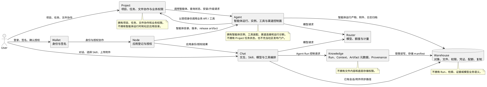
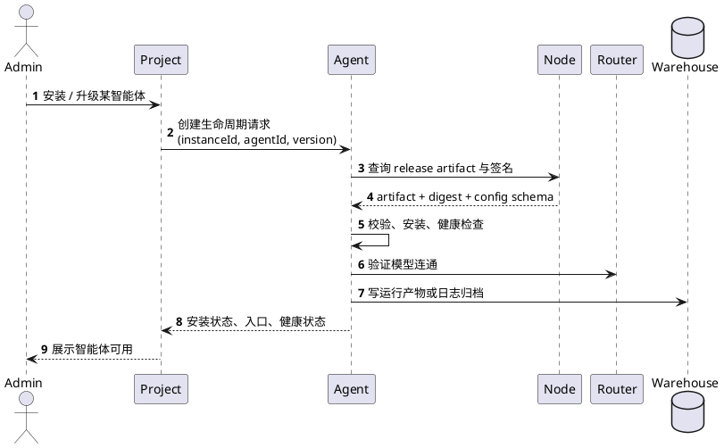
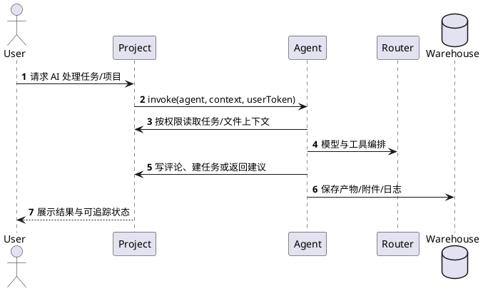
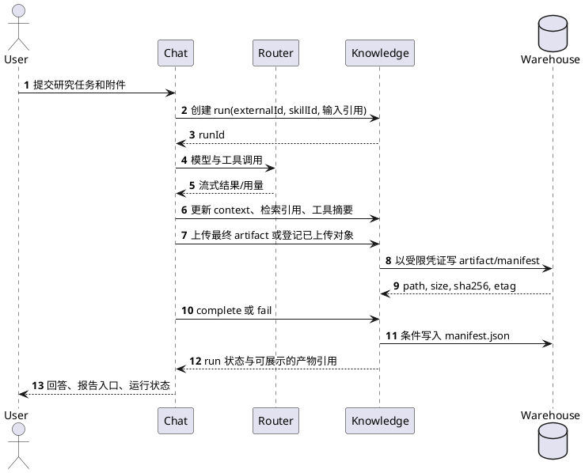
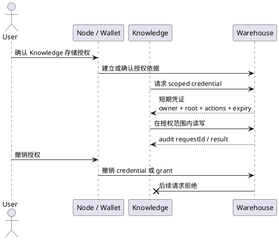
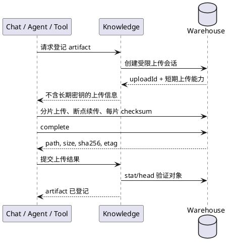

# 社区 AI 资产与智能体运行关系及开发边界

> 上游来源：[liuppx/books - 社区产品关系与开发边界.md](https://github.com/liuppx/books/blob/main/yeying/%E7%A4%BE%E5%8C%BA%E4%BA%A7%E5%93%81%E5%85%B3%E7%B3%BB%E4%B8%8E%E5%BC%80%E5%8F%91%E8%BE%B9%E7%95%8C.md)
>
> 本仓库保留该文档副本，用于说明 Knowledge 在社区系统中的定位。跨仓库事实以对应项目的版本化文档和 OpenAPI 契约为准。

> 状态：架构基线与开发协作约定
>
> 文档日期：2026-08-01
> 适用项目：Chat、Knowledge、Warehouse、Router、Node、Wallet、Project、Agent，以及需要保存或使用 AI 资产、智能体能力的后续服务

## 1. 目的

本文件定义社区项目在 AI 任务、知识、文件资产、身份、模型调用、智能体运行和业务系统接入上的职责边界。新服务在设计功能前，应先根据本文判断：

1. 业务状态应由哪个系统拥有。
2. 文件内容应保存在哪里。
3. 用户授权应由谁确认和执行。
4. 哪个服务可以调用哪个接口。
5. 已有能力是否足够，还是需要先补通用能力。
6. 该能力是“业务系统能力”、“智能体运行能力”还是“社区发布目录能力”。

它不是某个服务的 API 手册。具体 HTTP、S3、WebDAV 和数据库契约以各仓库的版本化 API 文档为准。

## 2. 总体结论

- **Chat** 是用户交互、模型编排、技能和工具执行层。
- **Knowledge** 是 AI 工作过程的控制面，拥有 `AgentRun`、context、artifact metadata 和 provenance。
- **Warehouse** 是智能体的第一手资产源和文件/对象数据面，拥有内容、路径、版本、checksum、权限、凭证、配额、复制和协议兼容；同时接收 Knowledge 对资产的派生结果和处理反馈。
- **Router** 是模型访问、计量、额度和模型渠道层。
- **Project** 是项目、任务、文件协作和团队工作流的业务系统，拥有任务状态、项目权限和业务上下文。
- **Agent** 是智能体运行控制面，拥有智能体实例、运行诊断、模型接入、工具装配、渠道连接和运行时生命周期。
- **Node / Wallet** 是社区应用登记、发布目录、用户登录与用户确认授权的来源；具体授权流程以其正式协议为准。

任何服务都不应通过复制另一服务的数据模型来绕过其边界。例如，Warehouse 不维护 `AgentRun`，Knowledge 不自行实现文件系统权限，Chat 不保存长期 Warehouse 服务凭证。

## 3. 系统关系



## 4. 能力归属表

| 能力 | 责任系统 | 其他服务的使用方式 | 不应放置的位置 |
| --- | --- | --- | --- |
| 用户聊天界面、流式回答、Skill 选择 | Chat | 调用 Router、Knowledge 或工具 | Warehouse、Knowledge |
| 模型路由、额度、请求计量 | Router | Chat 或业务服务通过模型 API 调用 | Chat 本地、Warehouse |
| AI 运行记录、输入引用、context、artifact metadata、provenance（数据模型为 `AgentRun`） | Knowledge | Chat 创建、更新和结束 run | Warehouse、Chat 会话存储 |
| 文件内容、目录、对象元数据、checksum、配额、复制 | Warehouse | S3、WebDAV 或受限服务接口 | Knowledge 数据库、Chat KV |
| 社区应用/智能体登记、版本、发布、审核、目录 | Node | Agent 或业务服务查询目录、下载 release artifact | Project、Agent 运行状态表 |
| 钱包私钥、签名、用户侧授权确认 | Wallet | 签发或协助完成授权 | 任意服务端数据库 |
| 项目、任务、团队工作流、业务权限 | Project | 通过 API、Skill、MCP 或 Agent 工具被调用 | Warehouse 目录结构、Agent 状态库 |
| 智能体实例、模型配置、工具装配、渠道连接、运行诊断 | Agent | Project/Chat 请求智能体执行，Agent 调用 Router、Project、Warehouse | Node 发布目录、Project 任务表 |
| 智能体安装、升级、失败回滚、卸载 | Agent | 从 Node 拉取 release artifact，在受控运行目录内执行生命周期 | Project Web 请求、Node Registry |

### 4.1 Chat 中 Skill 的运行边界

Chat 的 Skill 需要分成三层理解，不能把“技能入口”和“工具运行时”混为一谈：

| 层次 | 含义 | 当前责任系统 | standalone / Web | Tauri desktop |
| --- | --- | --- | --- | --- |
| Skill 定义与安装 | 技能名称、描述、入口、instructions、默认模型、候选模型、工具依赖声明、启动工作区 | Chat；可发现定义来自内置包或 marketplace，后续发布目录归 Node | 可用 | 可用 |
| Skill 会话运行 | 用户点击技能后进入 Chat 或专属工作区，创建带技能快照的会话，按技能配置选择模型、提示词、工具栏和启动条件 | Chat | 可用 | 可用 |
| 外部工具运行时 | 根据技能声明启动或连接 Tool Server，执行 MCP/API 工具调用，管理本实例工具配置和状态 | Chat standalone 当前本地承担；后续跨应用、长生命周期智能体运行归 Agent | 当前可用，依赖 Next Node 进程、Server Action、`ENABLE_TOOLS` 和 `data/tool_config.json` / `TOOL_CONFIG_PATH` | 当前不可用；Tauri 静态导出会使用禁用版 tool actions，不读取 `data/tool_config.json` |

因此：

- **desktop 不是没有 Skill**。桌面版可以展示、安装和启动不依赖本机外部 Tool Server 的技能，例如普通对话、图片创作、带模型约束或开场问题的任务技能。
- **desktop 当前缺的是外部工具运行时**。如果某个 Skill 声明了必需的 Tool Server / MCP 工具，desktop 只能展示“需要配置或不可用”，不能在本机静态包内直接启动 stdio 工具进程。
- **standalone 可以承担轻量工具运行时**。它有 Next Node 进程，可以读取实例级 `tool_config.json`，启动外部工具命令并执行 MCP 请求；这适合本地开发、私有部署和单实例受控服务。
- **长期运行的智能体不应塞进 Chat desktop**。需要安装、升级、回滚、进程守护、日志、渠道连接和诊断的智能体，应由 Agent 管理；Chat 只作为用户交互入口和调用方。
- **Node 提供发布目录，不提供运行时**。Skill Package、Tool Package 或 Agent Release 的发现、审核、版本和授权可以归 Node；是否能运行、在哪里运行、由谁持有配置和进程状态，必须由 Chat standalone 或 Agent 负责。

建议产品命名也保持区分：

| 用户可见名称 | 工程含义 | 不应混用为 |
| --- | --- | --- |
| 技能 / Skill | 用户选择的任务入口和运行配置 | MCP、插件、智能体进程 |
| 工具 / Tool | 模型可调用的外部能力 | Skill 本身 |
| Tool Server | 提供工具能力的运行服务，可用 MCP 等协议连接 | 社区发布目录 |
| 智能体 / Agent | 可长期运行、可安装升级、有生命周期和诊断的运行实体 | 普通 Chat 技能 |

## 5. Project、Agent 与 Node 的标准边界

Project、Agent、Node 是社区后续开发中最容易混淆的三类系统，应按“业务系统、运行控制面、发布目录”分层。

### 5.1 Project：业务系统与智能体消费方

Project 拥有项目管理业务事实：

- 用户、组织、项目、任务、文件、评论、权限和业务工作流。
- AI 助手入口、任务智能操作入口和业务上下文展示。
- 向 Agent 暴露受控业务工具，例如查询任务、创建任务、更新任务状态、写评论、读取知识库可见内容。
- 对所有业务工具执行 Project 自身权限校验；Agent 或 AI 不得绕过当前用户、项目成员、管理员等权限边界。

Project 不负责：

- 直接运行大模型。
- 管理智能体实例、OpenClaw/Nanobot profile、WhatsApp/DingTalk 等渠道连接。
- 作为社区应用发布中心。
- 在 Web 请求内执行安装、升级、回滚、卸载等运行时操作。

### 5.2 Agent：智能体运行控制面

Agent 是 Project 依赖的智能体能力提供方。它拥有：

- Hub 控制面、智能体实例、运行目录、端口、profile 和运行状态。
- 模型配置、Router 接入、工具注册、MCP 客户端、渠道连接和诊断恢复。
- 智能体生命周期：安装、启动、停止、升级、失败回滚、卸载。
- 智能体执行日志、健康检查、运行错误和恢复建议。

Agent 可以调用：

- Node：获取智能体目录、版本、release artifact、签名和授权结果。
- Router：调用模型。
- Project：以 Project 授权的用户或服务身份调用业务工具。
- Warehouse：保存智能体运行产物、附件、日志归档或大文件。

Agent 不负责：

- 存储 Project 的任务主数据。
- 替代 Node 做社区发布、审核、门户和目录运营。
- 直接持有用户钱包私钥或绕过 Wallet/Node 的授权流程。

### 5.3 Node：社区发布目录与授权入口

Node 是 Registry / Portal，而不是 Project 的运行时控制面。它拥有：

- 社区应用和智能体登记。
- 版本、发布、审核、下架、release artifact 元数据。
- 钱包身份、UCAN/授权协作、社区门户和应用详情页。

Node 可以向 Agent 提供：

- 已发布智能体列表。
- 指定版本 release artifact。
- release digest、签名、依赖声明和安装配置 schema。
- 用户或实例授权结果。

Node 不负责：

- 在 Project 生产机上启动或停止智能体进程。
- 写 Project 的 `docker/appstore/config` 或运行目录。
- 保存 Agent 的实例运行状态、日志和健康检查状态。

### 5.4 推荐调用关系



运行时执行任务时：



### 5.5 命名约定

为避免继续混淆，后续新文档和新接口优先使用下列术语：

| 场景 | 推荐名称 | 避免继续强化的名称 |
| --- | --- | --- |
| 社区发布目录 | Node Registry / 社区应用中心 | Project AppStore |
| 智能体运行控制面 | Agent Hub / Agent Runtime | Node AppStore Runtime |
| Project 接入层 | Agent Gateway / Agent Gateway | AppStore Controller |
| 智能体生命周期协议 | Agent Runtime Protocol | AppStore 安装协议 |

存量 `appstore` 命名可以先作为兼容层保留，但新增能力应明确指向 Agent。Project 中的 `APPSTORE_INTERNAL_URL` 如继续存在，应在注释中声明它是历史兼容名；社区模式下应指向 Agent Hub，而不是直接指向 Node。

## 6. AI 任务的标准调用关系

研究、分析、报告生成等需要留下可审计资产的任务，应采用下列模式。



约束：

- Chat 只保存 `runId` 和展示所需状态，不复制完整 run 控制面。
- Knowledge 只保存文件引用、摘要和元数据，不把大文件复制进自己的数据库。
- Warehouse 返回的 `sha256`、size 和 ETag 是文件完整性的存储侧事实。
- Knowledge 不可用时，普通 Chat 可以继续回答；该次任务必须明确标为未记录，而不能伪造 run 成功。

## 7. Warehouse 对 Knowledge 的标准能力

### 7.1 命名空间和最小权限

Knowledge 作为一个应用，使用固定应用根目录；每名用户在该根目录下独立隔离：

```text
/apps/knowledge.yeying.pub/
  uploads/
  sources/
  runs/<run-id>/
    artifacts/
    manifest.json
```

目录是逻辑命名空间，不代表宿主机物理路径。Warehouse 必须在所有协议入口统一执行路径规范化、根目录约束和权限检查。

### 7.2 服务访问授权

最终标准是短期、可撤销、目录范围受限的 storage credential，而不是让 Knowledge 长期保存用户主密码或无限范围密钥。



凭证至少绑定：`subject`、`owner`、`root`、`actions`、`expiresAt` 和 `grantId`。`Knowledge ServicePrincipal` 是 Knowledge 的内部身份，不能被 Warehouse 误建模为 Agent Run 或业务主体。

### 7.3 统一对象契约

无论通过 S3、WebDAV 还是未来的服务接口访问，同一对象应能得到一致的核心事实：

```json
{
  "path": "/apps/knowledge.yeying.pub/runs/run-123/manifest.json",
  "size": 2048,
  "contentType": "application/json",
  "etag": "...",
  "sha256": "...",
  "modifiedAt": "2026-08-01T12:00:00Z"
}
```

最低对象原语：`stat/head`、`list`、`get`、`put`、`delete`、`copy`、multipart create/upload/complete/abort。

### 7.4 完整性、并发和幂等

Warehouse 应提供以下通用保证：

| 能力 | 用途 |
| --- | --- |
| 服务端 SHA-256 校验并回传 | Knowledge 登记 artifact 和验证 manifest 引用 |
| `HEAD` 返回 SHA-256、size、ETag | 无需再次下载对象计算摘要 |
| `If-None-Match: *` | artifact key 只能首次创建，避免重试覆盖 |
| `If-Match: <etag>` | 防止并发覆盖 `manifest.json` |
| `Idempotency-Key` | 网络超时后安全重试写入 |
| multipart 最终完整对象 SHA-256 | 大文件不能以 multipart ETag 代替内容摘要 |

### 7.5 大文件上传

小型报告可以由 Knowledge 接收后写入 Warehouse。大文件、模型输出、数据集和媒体文件应使用短期单对象上传授权直接写入 Warehouse：



### 7.6 事件、审计和错误

Warehouse 应以持久化 outbox 为基础提供可补拉事件，例如：

```text
object.created
object.updated
object.deleted
object.moved
credential.revoked
quota.exceeded
```

事件必须有稳定 `eventId`、owner、path、ETag、SHA-256、大小和发生时间，消费者按 `eventId` 幂等。事件不得携带文件内容、长期凭证或用户敏感正文。

所有服务调用都必须返回 `requestId` 和机器可判定的错误码，例如：

```text
AUTH_INVALID
SCOPE_DENIED
OBJECT_NOT_FOUND
OBJECT_CONFLICT
CHECKSUM_MISMATCH
QUOTA_EXCEEDED
UPLOAD_EXPIRED
RATE_LIMITED
STORAGE_UNAVAILABLE
```

业务服务不得依赖解析 `permission denied` 等自然语言错误文本。

### 7.7 第一手材料与 Knowledge 反馈

Warehouse 是原始文件和对象的事实源，Knowledge 是对材料进行解析、检索和理解的反馈层：

- Warehouse 向 Knowledge 提供授权范围内的资产清单、版本内容和变更事件。
- Knowledge 的摘要、标签、抽取结果、索引状态和处理错误，必须绑定 `assetId`、`version` 和 `sha256` 后写回。
- 派生文件保存为独立资产，不能覆盖或污染原始文件。
- 原始资产更新后，旧版本的 Knowledge 结果应标记为过期，不能继续冒充当前版本结果。
- Warehouse 不负责模型推理、检索策略或 `AgentRun`；它只保证材料身份、完整性、授权和反馈可追踪。

```text
Warehouse 原始资产 -> Knowledge 解析/检索/理解
Warehouse <- Knowledge 摘要、派生资产、索引状态、质量反馈
```

## 8. 当前与目标能力

| 能力 | 当前状态 | 后续标准化方向 |
| --- | --- | --- |
| `personal` / `apps` / `services` 空间 | 已有 | 保持路径语义稳定 |
| WebDAV、S3、分片上传、checksum | 已有基础 | 统一对象摘要与服务契约 |
| 应用目录范围凭证 | 已有基础 | 发展为短期 scoped credential |
| Project 业务工具暴露给智能体 | 部分设计中 | 通过 Agent/MCP 统一鉴权、审计和调用 |
| Agent 智能体运行控制面 | 已有 Hub 基础 | 接管智能体安装、升级、回滚、卸载和诊断 |
| Node 智能体发布目录 | 需要边界收敛 | 仅作为 Registry/Portal，不做运行时控制 |
| Chat Skill 定义、安装和会话启动 | 已有基础，Web 与 desktop 均可用 | 继续作为 Chat 产品入口，保持技能快照和版本兼容 |
| Chat standalone 外部工具运行时 | 已有基础，依赖 Next Node 进程和实例级工具配置 | 保持为轻量、本实例、受控工具运行，不扩展为智能体生命周期控制面 |
| Chat desktop 外部工具运行时 | 当前禁用，Tauri 静态导出不读取 standalone 工具配置 | 若要支持，应单独设计 Tauri 用户数据目录、本机权限、签名、审计和用户确认，不复用源码目录配置 |
| Agent Run / manifest 业务模型 | Knowledge 已实现 | 不下沉至 Warehouse |
| Warehouse 作为 Knowledge 数据源与反馈接收方 | 需要补齐 | 资产版本、变更事件、版本绑定的 annotation/derived asset |
| 对象 SHA-256 查询 | 部分写入链路已有 | 标准化为所有协议可读取的对象事实 |
| 条件写入与幂等写 | 需要补齐 | HTTP/S3 语义一致化 |
| 上传会话 | 已有基础 | 支持服务签发的单对象直传 |
| 存储事件与补拉 | 需要补齐 | outbox、webhook、cursor API |
| 审计查询 | 需要完善 | 按 credential、owner、path、requestId 查询 |

## 9. 新服务接入检查表

开发一个新服务前，按顺序回答：

1. 该服务拥有的业务对象是什么？不能回答时，不应新建数据库表或目录协议。
2. 哪些内容是文件对象，哪些只是数据库元数据？文件写 Warehouse，业务元数据归服务自身。
3. 所需存储根目录是什么？必须使用明确的 `/apps/<app-id>/` 或授权的 `/services/<service-id>/`，不能写用户根目录。
4. 用户如何授权？必须是可撤销、最小权限、可过期的授权，不传递用户长期主密钥。
5. 是否需要大文件、断点续传或客户端直传？需要时必须复用 Warehouse 上传会话或 S3 multipart。
6. 是否需要重试？需要时必须设计 `Idempotency-Key`、条件写入和重复事件处理。
7. 是否需要检索、运行记录、任务状态或 provenance？这些属于 Knowledge 或该业务服务，不属于 Warehouse。
8. 出错后用户看见什么、运维如何定位？必须传播 `requestId` 与结构化错误码。
9. 如果该服务要提供智能体能力，它是发布目录、运行控制面还是业务消费方？发布目录归 Node，运行控制面归 Agent，业务上下文归 Project。
10. 如果智能体要操作 Project 数据，是否明确了调用身份、权限校验、审计日志和失败回滚方式？不能让智能体直接写库或绕过 Project API。

## 10. 不允许的设计

- 不在 Warehouse 建立 Chat、Knowledge、Project 等服务的业务状态机。
- 不在 Knowledge 数据库保存文件二进制或用数据库模拟对象存储。
- 不在 Node 中实现 Project 生产机上的智能体进程管理、健康检查和回滚。
- 不在 Project Web 请求内直接执行智能体安装、升级、卸载、镜像拉取或容器操作。
- 不让 Agent 直接修改 Project 数据库来完成任务操作；必须走 Project 授权 API 或明确的工具协议。
- 不把社区发布目录、智能体运行状态和业务任务状态混在同一个 `appstore` 数据模型中。
- 不把 Warehouse 长期管理员凭证、用户主密码或全局 service key 发送给浏览器、桌面端或第三方工具。
- 不让应用以“用户根目录可写”为默认权限。
- 不通过中文显示名称、路径字符串猜测或错误文本判断权限、身份或状态。
- 不把 S3 multipart ETag 当作完整文件的 SHA-256。
- 不因尚未实现的版本、事件或 STS 能力，在业务层各自复制一套临时实现。

## 11. 推进顺序

第一阶段使 Knowledge Agent Run 稳定落地：对象 SHA-256 查询、条件写入、幂等上传、结构化错误和请求追踪。

第二阶段明确 Project、Agent、Node 的智能体接入边界：Project 只做业务消费方，Agent 接管智能体运行控制面，Node 只做社区发布目录和授权入口。

第三阶段支持生产级服务集成：短期 scoped credential、单对象直传、大文件 multipart 完整性和审计查询。

第四阶段形成可复用平台：对象变更事件、生命周期、不可变快照、版本、批量操作、复制状态查询，以及 Agent Runtime Protocol 的跨服务复用。

每一阶段都应由至少一个真实服务验证。当前首个验证者是 Knowledge，Chat 通过 Knowledge 接入；不能为了接入而把 Knowledge 的控制面逻辑迁回 Warehouse。
